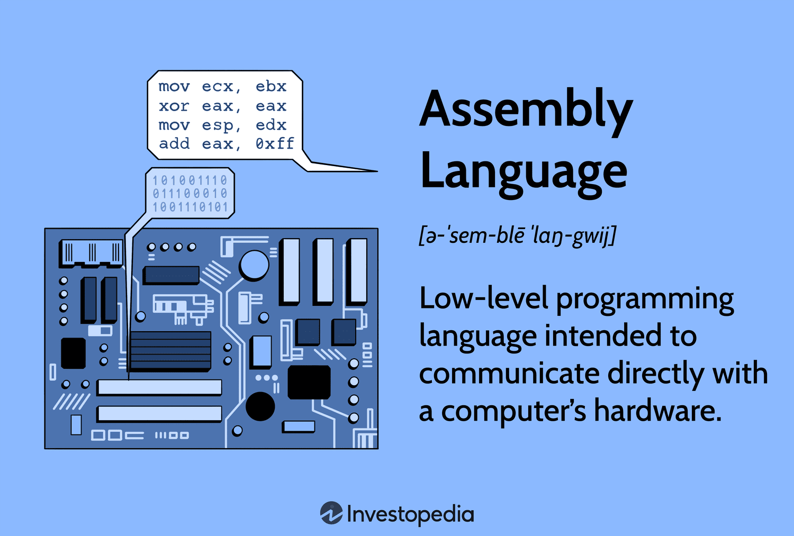

# Assembly Basics
- 🧠 Registers: rax, rbx, rcx, rdx, rsi, rdi, rbp, rsp
- ⚙️ Instructions: mov, lea, add, sub, cmp, test, jmp, je/jne, call, ret
- 📚 Stack frame: push/pop, function prologue/epilogue

---

## ASM / Assembly
Hay còn gọi là hợp ngữ. Đây là một loại ngôn ngữ lập trình cấp thấp, gần với với ngôn ngữ máy (machine code) mà CPU trực tiếp hiểu, nhưng dễ đọc hơn nhờ các ký hiệu và lệnh dễ nhớ.

Dễ hình dung:
- Ngôn ngữ máy là cá dãy số 0 và 1 và CPU thực sự chạy.
- Ví dụ: 1011000001100001

- Assembly: là cách viết dễ đọc hơn cho cùng lệnh đó.
- Ví dụ: MOV AL, 61h (đưa giá trị 0x61 vào thanh ghi AL)

---

### Đặc điểm chính của ASM
1. Gần phần cứng: Trực tiếp điều khiển CPI, thanh ghi (register), bộ nhớ
2. Hiệu năng cao: Có thể tối ưu hóa rất tốt, nhưng khó viết và khó bảo trì.
3. Phụ thuộc CPU: Mỗi loại CPU (x86, ARM, MIPS...) có tập lệnh Assembly khác nhau.
4. Dùng trong:
    - Reverse engineering (phân tích phần mềm)
    - Viết driver hoặc hệ điều hành
    - Tối ưu hóa code quan trọng về tốc độ
    - CTF và malware analysis

Ví dụ nhỏ với x86 Assembly:
```
MOV AX, 5    ; Đưa số 5 vào thanh ghi AX
ADD AX, 3    ; Cộng 3 vào AX, bây giờ AX = 8
```

Sơ đồ minh họa Python -> C -> ASM -> Machine code:

```
Python code
   │
   ▼ (1) Interpreter / Compiler (CPython)
C code (hoặc nội bộ bytecode)
   │
   ▼ (2) Compiler (ví dụ gcc, clang)
Assembly (ASM)
   │
   ▼ (3) Assembler
Machine code (binary 0 & 1)

```

---

## 🧠 Register
### 1️⃣ Khái niệm
Trong Assembly (ASM), register là một khái niệm cực kỳ quan trọng. Nói nôm na, register là những "ô nhớ siêu nhanh" bên trong CPU, dùng để lưu dữ liệu tạm thời khi chương trình chạy.

- CPU có bộ nhớ Register nhanh hơn RAM rất nhiều.
- ASM dùng register để thực hiện tính toán, truyền dữ liệu, gọi hàm.
- Mỗi register thường chỉ chứa được 1 giá trị, ví dụ số nguyên, địa chỉ bộ nhớ hay là con trỏ.

---

### 2️⃣ Một số Register phổ biến trong x86-64

| Register | Mục đích chính                                                   |
| -------- | ---------------------------------------------------------------- |
| `rax`    | Accumulator – tính toán, trả về giá trị từ hàm                   |
| `rbx`    | Base – lưu trữ dữ liệu tạm, không bị hàm thay đổi (callee-saved) |
| `rcx`    | Counter – dùng cho vòng lặp, số lần lặp                          |
| `rdx`    | Data – tính toán, truyền tham số hàm                             |
| `rsi`    | Source Index – địa chỉ nguồn khi copy dữ liệu                    |
| `rdi`    | Destination Index – địa chỉ đích khi copy dữ liệu                |
| `rbp`    | Base Pointer – đánh dấu đầu stack frame                          |
| `rsp`    | Stack Pointer – đánh dấu đỉnh stack                              |

`💡 Lưu ý: Tên register khác nhau giữa kiến trúc CPU (x86, ARM, MIPS…).`

### 3️⃣ Ví dụ sử dụng Register trong ASM
```
mov rax, 5    ; đưa số 5 vào register rax
add rax, 3    ; cộng 3 vào rax → rax = 8
mov rbx, rax  ; sao chép giá trị rax vào rbx
```
- Đây là thao tác trực tiếp trên register, CPU làm việc cực nhanh vì không phải đọc/ghi RAM.

---

## ⚙️ Instructions
### 1️⃣ Khái niệm
Trong ASM, mọt instruction (lệnh) là một chỉ thị cho CPU thực hiện một hành động cụ thể.

Mỗi instruction sẽ thao tác trên register, bộ nhớ hoặc stack, ví dụ: tính toán, so sánh, nhảy, gọi hàm...

Instruction = atomic operation của CPU: nghĩa là CPU sẽ hoàn tất lệnh trước khi làm lệnh tiếp theo.

Instruction có thể gồm: 
1. Opcode - Từ khóa xác định hành động (ví dụ: mov, add)
2. Operand(s) - đối số (giá trị, register, địa chỉ) mà lệnh thao tác

---

Ví dụ tổng quát:
```
mov rax, rbx
```
- mov -> opcode (lệnh gán)
- rax, rbx -> operands (thao tác copy từ rbx vào rax)

`💡 Tóm tắt: Instruction = “mệnh lệnh CPU hiểu được, thực hiện một thao tác cụ thể”.`

---

### 2️⃣ Các lệnh cơ bản

| Instruction | Mục đích / Chức năng                                   | Cú pháp cơ bản        | Ví dụ                                  |
| ----------- | ------------------------------------------------------ | --------------------- | -------------------------------------- |
| `mov`       | Chuyển dữ liệu từ source → destination                 | `mov dest, src`       | `mov rax, rbx` (rax = rbx)             |
| `lea`       | Lấy địa chỉ hiệu dụng của toán hạng, không lấy giá trị | `lea dest, [src]`     | `lea rax, [rbx+4]`                     |
| `add`       | Cộng giá trị vào destination                           | `add dest, src`       | `add rax, 3` (rax += 3)                |
| `sub`       | Trừ giá trị từ destination                             | `sub dest, src`       | `sub rbx, 2` (rbx -= 2)                |
| `cmp`       | So sánh hai toán hạng → set flags (ZF, SF…)            | `cmp op1, op2`        | `cmp rax, rbx`                         |
| `test`      | Kiểm tra bit (AND) → set flags nhưng không lưu kết quả | `test op1, op2`       | `test rax, rax`                        |
| `jmp`       | Nhảy không điều kiện                                   | `jmp label`           | `jmp loop_start`                       |
| `je`        | Nhảy nếu bằng (Zero Flag = 1)                          | `je label`            | `cmp rax, rbx`<br>`je equal_label`     |
| `jne`       | Nhảy nếu khác (Zero Flag = 0)                          | `jne label`           | `cmp rax, rbx`<br>`jne notequal_label` |
| `call`      | Gọi hàm, lưu return address trên stack                 | `call function_label` | `call my_function`                     |
| `ret`       | Trở về từ hàm (jump tới return address)                | `ret`                 | `ret`                                  |

---

`💡 Ghi nhớ nhanh:`

- mov, lea → gán / lấy địa chỉ
- add, sub → tính toán
- cmp, test → so sánh / kiểm tra bit
- jmp, je, jne → nhảy (có/không điều kiện)
- call, ret → gọi / trả về hàm

---

## 📚 Stack frame
### 1️⃣ Khái niệm

- Stack = ngăn xếp trong bộ nhớ, hoạt động theo nguyên tắc LIFO(last in, first out)
- Stack dùng để:
   - Lưu tham số hàm (nếu vượt quá số register có sẵn)
   - Lưu lại address khi gọi hàm (call)
   - Lưu register tạm thời hoặc biến cục bọ

- Stack frame = khung bộ nhớ của 1 hàm, gồm:
   - Return address -> địa chỉ hàm gọi (call)
   - Saved register -> register cần giữ nguyên qua hàm
   - Local variables -> biến cục bộ

- Mỗi lần gọi hàm -> Tạo một stack mới, khi hàm kết thúc -> pop stack frame

---

### 2️⃣ Lệnh cơ bản liên quan tới stack

| Instruction           | Mục đích / Chức năng                               | Ví dụ                                   |
| --------------------- | -------------------------------------------------- | --------------------------------------- |
| `push`                | Đẩy giá trị lên đỉnh stack (giảm `rsp`)            | `push rax` → lưu rax lên stack          |
| `pop`                 | Lấy giá trị từ đỉnh stack ra register (tăng `rsp`) | `pop rbx` → rbx = giá trị trên stack    |
| **Function Prologue** | Chuẩn bị stack frame khi vào hàm                   | `asm push rbp mov rbp, rsp sub rsp, 16` |
| **Function Epilogue** | Dọn stack frame khi ra khỏi hàm                    | `asm mov rsp, rbp pop rbp ret`          |

---

### 3️⃣ Giải thích Function Prologue / Epilogue

Function Prologue – bước chuẩn bị stack frame
1. push rbp → lưu base pointer cũ lên stack
2. mov rbp, rsp → đặt rbp mới = đỉnh stack hiện tại
3. sub rsp, N → cấp phát N byte cho biến cục bộ

Ví dụ:
```
push rbp
mov rbp, rsp
sub rsp, 16   ; tạo 16 byte cho local variables
```

---

Function Epilogue – bước dọn dẹp stack frame
1. mov rsp, rbp → trả stack pointer về đầu frame
2. pop rbp → phục hồi base pointer cũ
3. ret → nhảy về return address

Ví dụ:
```
mov rsp, rbp
pop rbp
ret
```

---

Ví dụ minh họa tổng thể
```
foo:
    push rbp          ; lưu rbp cũ
    mov rbp, rsp      ; thiết lập stack frame
    sub rsp, 16       ; cấp phát 16 byte cho biến cục bộ

    ; --- body of function ---
    mov rax, 5
    add rax, 3

    mov rsp, rbp      ; dọn stack frame
    pop rbp           ; phục hồi rbp cũ
    ret               ; trả về hàm gọi
```
- push/pop → thao tác lưu và lấy giá trị trên stack
- Prologue/Epilogue → chuẩn hóa stack frame của hàm

